# blog_flask

#### Video Demo: https://youtu.be/t3SGqwRMO6o
#### Description:

A responsive blog and blog management software with different user classes, including admin and author sections created using python flask and bootstrap.
_The Travel Blog_ features post by authors where users can like, bookmark and comment. Admins receive emails from the contact form and are able to manage users, approve and edit blog posts submitted by authors. 

---

## [Table of contents](#table-of-contents)
- [Installation](#installation)
    - [Step 1: cloning this repository](#step-1:-cloning-this-repository)
    - [Step 2: installing the dependencies](#step-2:-installing-the-dependencies)
    - [Step 3: create a .env file](#Step-3:-create-a-.env-file)
    - [Step 4: create a .gitignore file](#step-4:-create-a-.gitignore-file)
    - [Step 5: run the app](#step-5:-run-the-app)
- [Project overview](#project-overview)
    - [Visitors and users](#visitors-and-users)
    - [Authors](#authors)
    - [Admin and super admin](#admin-and-super-admin)
    - [Account blocking and deletion](#account-blocking-and-deletion)
    - [Contact form](#contact-form)
    - [Mobile use](#mobile-use)
- [Code overview](#code-overview)
    - [Code organization](#code-organization)
    - [Database models](#database-models)
- [Project limitations and improvement ideas](#project-limitations-and-improvement-ideas)
- [About and License](#about-and-license)

---

## Installation

Anyone is welcome to clone this repository. 
A couple of steps are needed for you to be able to run it properly:

1. cloning this repo
2. install the required dependencies
3. create an .env and a .gitignore file
4. open run.py to run the code

### Step 1: cloning this repository
You may clone the repository to your local machine and push it to your own repository in your github account.
An explanation about how to go about that can be found in this Stackoverflow answer: https://stackoverflow.com/a/44076938/14517941

### Step 2: installing the dependencies
When you open the folder with your code editor, you will find the requirements.txt file.
Use the `pip install -r requirements.txt` command to install all the modules.
If you make changes to the project you can update the requirements.txt or create a new requirements.txt file with the command `pip freeze > requirements.txt` . This will output a list of all installed Python modules with their versions.
Example:

Python 3.x

Flask

Jinja2

### Step 3: create a .env file
Create a .env file inside the blog_flask folder.
You should add the following variables:

`EMAIL_ADDRESS = "..."` <-- replace `...` with your gmail address

`EMAIL_PASSWORD = "..."` <-- replace `...` with your gmail app password (two-step verification needed)

The email address and password will be used to receive messages sent through the contact form.
The credentials (email address and password) have been saved to an .env file, and the variables imported into app>website>contact.py, which containes a helper function, which is then used in app>website>routes.py. This information must be replaced for the code to work locally by anyone willing to use the codebase.
Messages sent though the contact form are sent and received by a gmail account. If another provider is used, replace "smtp.gmail.com" with the information from the other provider in app>website>contact.py.
At the time of writing, Gmail allowed users to create an app password to send emails from python. You can google ' Sign in with App Passwords - Gmail Help' to learn how to create one (or follow this link: https://support.google.com/mail/answer/185833?hl=en).
You will not want your gmail address and password to enter the public domain. This is the reason you want to place them in the .env and include the .env in your gitignore (next step).

### Step 4: create a .gitignore file
Create a .gitignore file inside the blog_flask folder.
You should add the following to it:

instance/

.env

\__pycache__

Alternatively, you may also find online a better and more complete template to use.
This step is only important if you are using git, since it's purpose is to avoid uploading sensitive information or unecessary files to your repository.

### Step 5: run the app
You can run the run.py file and open it using local host. 
That's it, you have installed the project and are ready to use the code!

It is recommended you check out the <a href="#code-overview">code overview</a> - and the <a href="#database-changes">database changes</a> part in particular before making changes to the code and the database. 

[ <a href="#table-of-contents">↑ to top ↑</a> ]

---

## Project overview
This project is composed of a blog and blog management interface with multiple user classes. Different user tasks can perform different tasks in the blog. Information about the code and technical aspects can be found in the <a href="#code-overview">code overview</a> section.

A quick overview of user types:

| Type | Access |
| --- | --- |
| Visitors | Visitors are non-logged in users who enter the site. The blog pages 'Home', 'All Posts', 'About', and 'Contact' can be viewed by any person accessing the website, while it also contains a log-in and sign-up section. |
| Users | Any person can create an account. Logged-in users are able to comment on posts, bookmark posts, like posts, and change their profile picture and description. |
| Authors | Authors can add new posts with picture and SEO-relevant information to the blog, besides being able to perform all actions registered users can perform. |
| Admins | Admins can edit blog posts, manage (block/edit) users of types User and Author, besides being able to perform all actions registered users can perform.|
| Super-Admin | Super-admin can perform all tasks that Admins can, as well as being able to edit and block accounts of other admin users. |

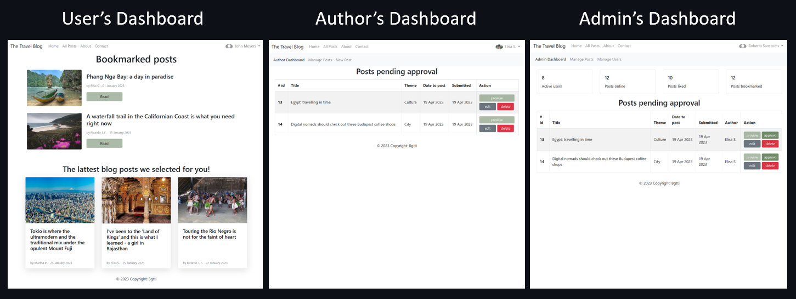

### Visitors and users
Website visitors are able to see the blog main content of published posts, the about section, and use the contact form. Visitors can create an account.

While visitors would be able to see all public pages of the blog, they would only be able to join a conversation (comment and reply to comments on posts) once signed up and logged in. They would also be able to like and save posts by bookmarking them. Users may also edit their profiles and add profile pictures. 

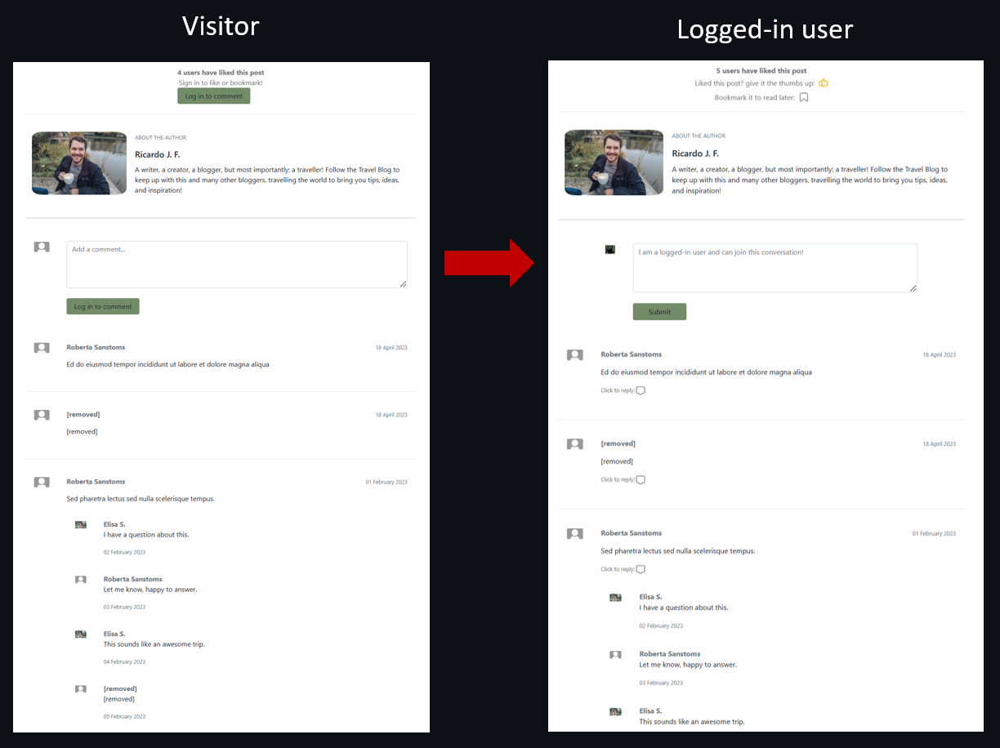

Upon log-in users are directed to a dashboard where they can see their lattest bookmarked posts (if any). They may see their inbox page, which features their lattest comments in posts, where they may see if there were any replies to their comments. Also, they can manage their accounts' picture by downloading a new one from their computers or change their profile information and visible username.

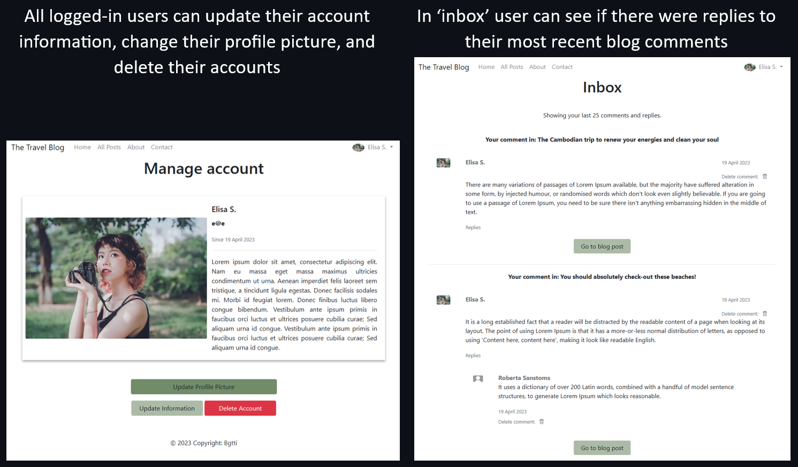

### Authors
Authors can submit a blog post, which will need admin aproval prior to being published. Since authors are trusted user types, they may control the html of the post through the rich text editor, to better manage how the post is displayed. They may upload pictures from their machines to blog posts, edit blog post, and delete them. Authors may also engage with their audience in a conversation in the comment section.

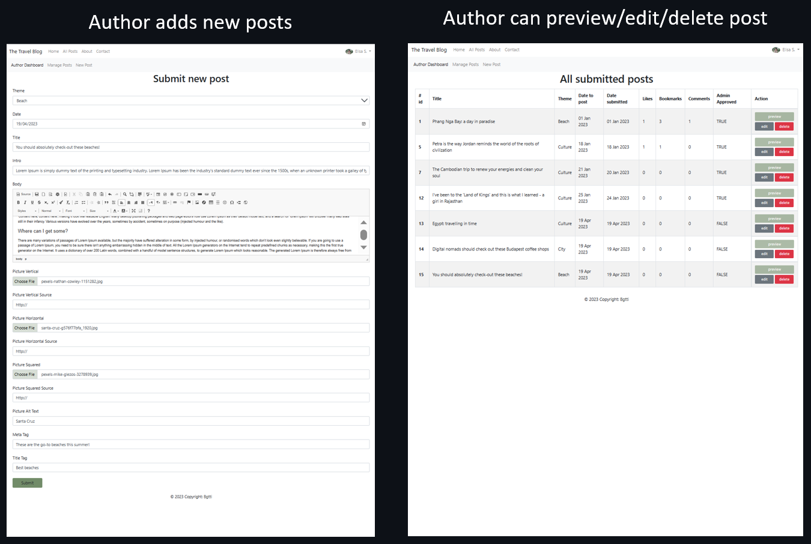

### Admin and super admin
Admins are responsible for user management and post management - and thus, for content moderation. There is only one super admin, and this is the only user who can block/unblock/edit/delete other admin accounts. Any admin type can edit/delete/approve/disapprove blog posts. Only approved blog posts are published on the blog, and only on or after the designated publish date.

### Account blocking and deletion
When a user is blocked, he/she can no longer access his/her account. Comments and replies appear as "removed" on posts. User and authors can be blocked/unblocked by any admin, but admin-type accounts can only be blocked/unblocked by the super admin.

When an account is deleted, the user's name and text on comments/replies appear as 'deleted' whenever part of a conversation flow. This is the same behavious as when a user deleted the comment or reply him/herself: it will only be deleted if it is a stand-alone, but the test will be replaced with 'deleted' in case this might affect the flow of a conversation. Keeping the flow in mind, in order to delete the user, but keep the comment/reply in its original place, these are passed on to a default user in the database (called 'deleted')

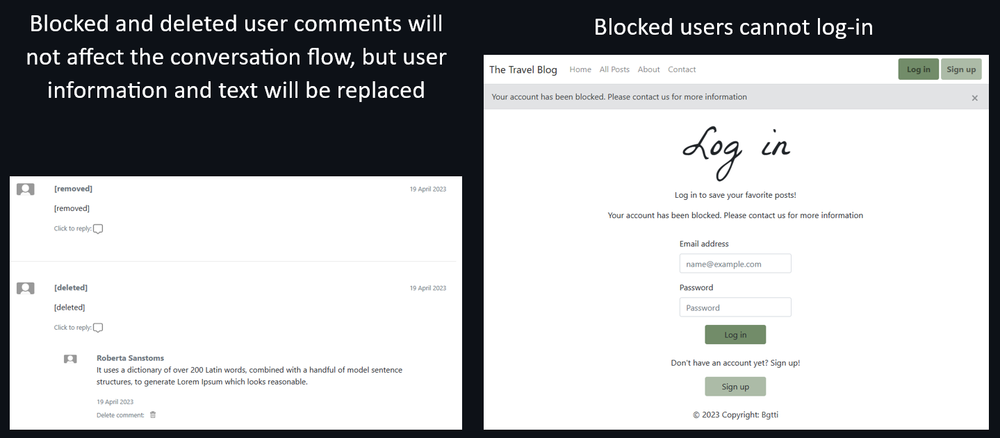

When the user in question is an author, the author's posts' ownership will be passed on to a default user named 'Travel Blog Team'. It is assumed here the authors are blog employees, and their work belongs to the company - with this reasoning, the material continues online even when the author is removed from the team.

User information is deleted when the user - of any type - is deleted or deletes his/her own account.

### Contact form
Emails can be sent through the contact form to an email account. The blog currently sends the email to a gmail account `smtplib.SMTP_SSL("smtp.gmail.com") as connection` in contact.py.

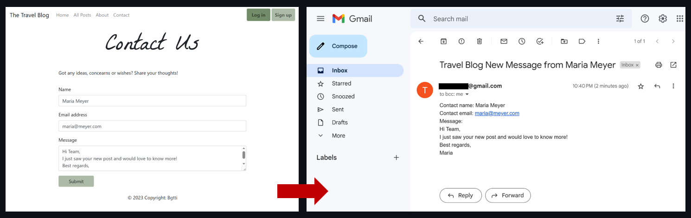

The emails are also saved to the database, but they are not currently being displayed on the blog. This is listed as an idea for future development.

### Mobile use
The blog is responsive and blog pages should display well on mobile (tested in chromium browsers only).
User and post management features (displayed for authors and admin accounts), although possible to use on small devices, are better designed for desktop usage. This is especially true for user and post tables, which could be designed in the future to be displayed in card-like format on smaller screens. This is also a future improvement idea.

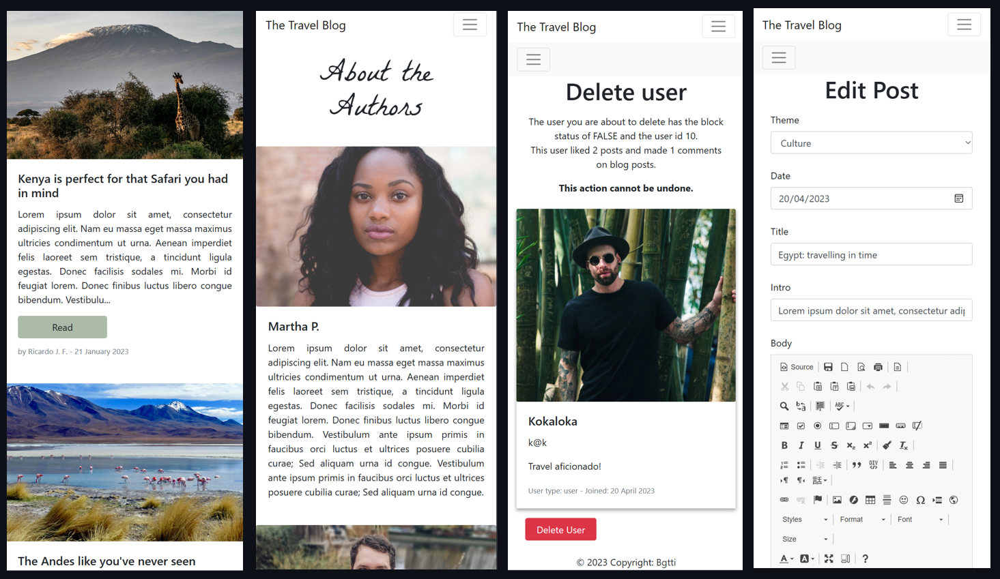

[ <a href="#table-of-contents">↑ to top ↑</a> ]

---

## Code overview
The project was written in python flask (with Blueprints), using SQLite as the database (with the help of SQLalchemy), and uses bootstrap and CSS for styling.
JavaScript was only used when necessary: to determine sizes of images prior to upload, and to allow for comments, bookmarking, and liking posts, as well as alert message display without re-loading the page for a better user experience.

The windows command `tree` yields the following file structure within the blog_flask folder:

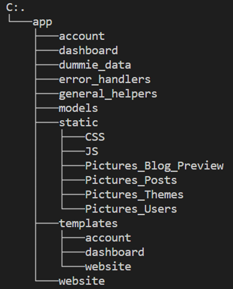

| Folder | Content |
| --- | --- |
| blog_flask | app initiation files such as run.py and create_db.py, as well as .env and .gitignore |
| app | app configuration files as well as all folders that make up the app and its blueprints such as static, db models, and routes|
| account, dashboard, error_handlers, and website | the folders containing the routes and their helper functions and forms|
| dummie_data | files with lists of dictionaries with information used to create the visible data such as blog post text and author details |
| general_helpers | helper functions that can be used by any module containing routes |
| models | contain all database models as classes |
| static | contains the CSS and JS files, as well as pictures |
| templates | the html files are sub-divided into folders named after the blueprint using them |

The routes were separated into four base folders inside the 'app' folder: website, account, dashboard, and error_handlers. The reason for this was to create a better separation of concerns by dividing the routes according to user access through Blueprints, to avoid one huge .py file and make navigating the code an easier task. 

The folders inside the app folder will be explored in more detail bellow. Note the windows command `tree/F` will give you the full folder and file structure in the terminal, but given the high number of pictures and template files, only an overview is shown here which does not include all html and image files.

WTForms was used for log-in validation and forms in general. The rich text editor (used to create and edit posts) is CKEditor.

### Code organization
In this section we shall explore the contents of the folders in more detail, subdivided into the following sub-topics:

- [blog_flask and app folders](#blog_flask-and-app-folders)
- [routes: account, dashboard, error_handlers, and website](#routes-folders)
- [models, general_helpers, dummie data, static, and templates](#other-folders)

#### blog_flask and app folders
The project can be ran in run.py which will cann on app/extensions.py and create_db.py to create the app and initiate the database.

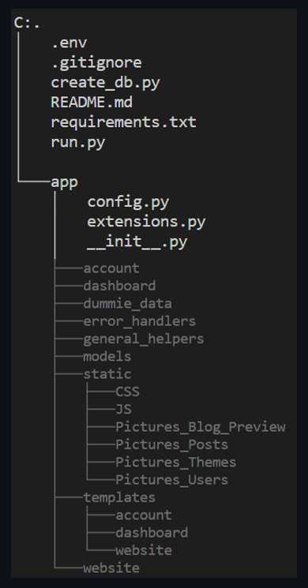

The blog_flask folder contains:
- **'app' folder**: where the code is
- **'.env' file**: with sensitive information such as the email address and password used to receive email from the contact form. Can't be downloaded, so instructions how to create it can be found in the <a href="#table-of-contents">installation section</a>.
- **'.gitignore'**: which is used to inform git about files that shouldn't be uploaded to the git repository, such as the .env file. Can't be downloaded, so instructions how to create it can be found in the <a href="#table-of-contents">installation section</a>.
- **'create_db.py'**: the file uses the db models to create the database. It is also used to create the 'Super-Admin' user, the 'default user' and 'default author' accounts, which are necessary in order to allow for the creation of other 'admin' and 'author' accounts, as well as to allow deletion of users without the loss of content. It also sets up dummy user accounts which can be used for testing, and the blog posts, blog themes and dummy comments, likes and bookmarks.
- **'requirements.txt'**: stores the required dependencies for this project. More details about it in the <a href="#table-of-contents">installation section</a>.
- **'run.py'**: used to create the app, initiate the database, and populate the database using the 'create_db.py' file. This is the python file one should run to initiate the app. Once you run it, you will see the 'instance' folder being created.

In the 'app' folder, you will find the subfolders that make up the app, as well as three important files:
- **'\__init__.py'**: used to mark a directory and indicate that is is a package. This file registers the Blueprints, for instance.
- **'config.py'**: stores key value pairs that can be read or accessed in the code.
- **'extensions.py'**: used to define and organize extensions. It is used to register the SQLAlchemy, CKEditor, and LoginManager extensions with the Flask app instance app, allowing them to be used throughout the application.

The config file is of special importance. It is here where the path to saving pictures is defined, as wll as the `MAX_CONTENT_LENGTH` configuration, which will block big files from being uploaded by the user. 

You will note that all subfolders (with the exception of templates and static) contain an empty '\__init__.py' file. This is needed for them to be recognized as blueprints, and their functions can be referred to inside other files in the form 'app.blueprint_name.filename_name'. Example: `from app.dashboard.helpers import check_blog_picture` imports the check_blog_picture function contained in the helpers file which is in the dashboard folder which is in the app folder.

#### routes: account, dashboard, error_handlers, and website

The routes to the html files in templates are found in four blueprints:

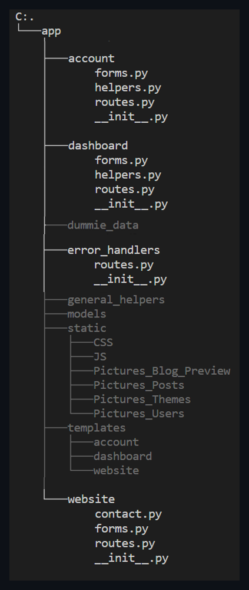

- **'account' folder**: contains 'routes.py' which are all the routes that can be accessed by a logged-in user (routes to the log-in, sign-up, and log-out pages, dashboard, account management page, etc), as well as 'helpers.py' containing helpful functions such as hashing a password, and 'forms.py' used for a Flask Form Class.
- **'dashboard' folder**: contains 'routes.py' which contains routes that can be accessed by 'admin' and 'author' type users (routes for user account and post management pages), as well as a 'forms.py' used for a Flask Form Class. It's helpers.py file contain functions such as to check if an uploaded blog image presents the correct file extension.
- **'error_handlers' folder**: contains 'routes.py' which render the 404 and 500 error pages.
- **'website' folder**: contains 'routes.py' which has the routes to website pages which visiting users can access (such as the home page, 'All Posts', 'About', and 'Contact'). The contact.py folder contains the function responsible for sending emails from the contact form.

#### models, general_helpers, dummie data, static, and templates

An overview of what is contained in the other folders inside the app folder (without html and image files):

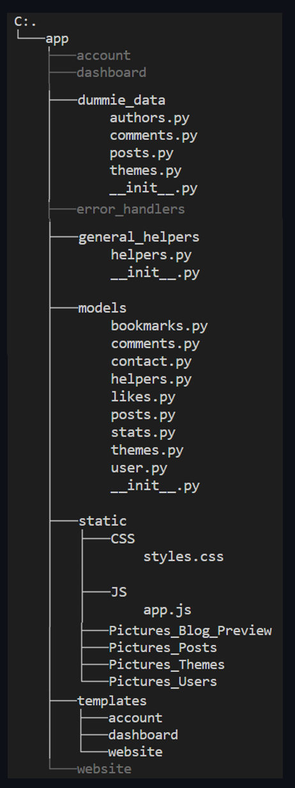

- **'dummie_data' folder**: contains files with lists of information about authors, comments, posts, and themes which are used by 'create_db.py' to add the information in these files to insert information to the database when the project is first run. The data will be used to create dummie users, comments, posts, and themes that are necessary to first preview the blog. 

- **'models' folder**: contains multiple files which are database models necessary to instanciate the database.
- **'static' folder**: contains the CSS and JS files, as well as folders containing pictures used in blog posts and user profiles. The Pictures_Blog_Preview folder contains all pictures used in this Readme.md file. Pictures_Posts are where pictures used in the blog posts or post display areas such as the home page are contained and saved into when uploaded by authors or admins. Pictures_Themes are pictures of the themes which classify posts into groups. Pictures_Users is the folder which contains images uploaded by users to be displayed on their profiles.
- **'templates' folder**: contains the html files. 'base.html' is used to extend all other files. Besides 'base.html', '404.html' and '500.html', all other html files are placed into three folders ('account', 'dashboard', and 'website'), according to the Blueprint names (where you will find the routes).

### Database models
The SQLALchemy library was used to facilitate the use of tables with python, and this project leverages it's method of associating classes defined in python with database tables. Adding a model to the modules file may not necessarily create the database on its own. The mention of the database model is in create_db.py, and the functions are contained in run.py so that the models are recognized upon running the application.

Most tables are linked to each other with one-to-many relationships. A blog user may like multiple posts, and each post may have multiple likes associated to them, for instance. Bellow a database schema that summarizes the tables used in this project.

<table><tr><th>type</th><th>name</th><th>tbl_name</th><th>rootpage</th><th>sql</th><tr><tr><td>table</td><td>blog_user</td><td>blog_user</td><td>2</td><td>CREATE TABLE blog_user (
	id INTEGER NOT NULL, 
	name VARCHAR(200) NOT NULL, 
	email VARCHAR(200) NOT NULL, 
	password VARCHAR(200) NOT NULL, 
	date_created DATETIME, 
	about VARCHAR(385), 
	picture VARCHAR, 
	type VARCHAR(100) NOT NULL, 
	blocked VARCHAR(5), 
	admin_notes TEXT, 
	PRIMARY KEY (id), 
	UNIQUE (name), 
	UNIQUE (email)
)</td></tr><tr><td>index</td><td>sqlite_autoindex_blog_user_1</td><td>blog_user</td><td>3</td><td>NULL</td></tr><tr><td>index</td><td>sqlite_autoindex_blog_user_2</td><td>blog_user</td><td>4</td><td>NULL</td></tr><tr><td>table</td><td>blog_theme</td><td>blog_theme</td><td>5</td><td>CREATE TABLE blog_theme (
	id INTEGER NOT NULL, 
	theme VARCHAR(30) NOT NULL, 
	picture VARCHAR(700) NOT NULL, 
	picture_source VARCHAR(700), 
	PRIMARY KEY (id)
)</td></tr><tr><td>table</td><td>blog_stats</td><td>blog_stats</td><td>6</td><td>CREATE TABLE blog_stats (
	id INTEGER NOT NULL, 
	user_total INTEGER, 
	user_active_total INTEGER, 
	posts_approved INTEGER, 
	comments_total INTEGER, 
	likes_total INTEGER, 
	bookmarks_total INTEGER, 
	PRIMARY KEY (id)
)</td></tr><tr><td>table</td><td>blog_contact</td><td>blog_contact</td><td>7</td><td>CREATE TABLE blog_contact (
	id INTEGER NOT NULL, 
	name VARCHAR(200) NOT NULL, 
	date_created DATETIME, 
	email VARCHAR(100) NOT NULL, 
	message VARCHAR(700), 
	PRIMARY KEY (id)
)</td></tr><tr><td>table</td><td>blog_posts</td><td>blog_posts</td><td>8</td><td>CREATE TABLE blog_posts (
	id INTEGER NOT NULL, 
	date_submitted DATETIME, 
	date_to_post DATETIME, 
	title VARCHAR(200) NOT NULL, 
	intro VARCHAR(200) NOT NULL, 
	body TEXT NOT NULL, 
	picture_v VARCHAR(200), 
	picture_v_source VARCHAR(500), 
	picture_h VARCHAR(200), 
	picture_h_source VARCHAR(500), 
	picture_s VARCHAR(200), 
	picture_s_source VARCHAR(500), 
	picture_alt VARCHAR(200), 
	meta_tag VARCHAR(200), 
	title_tag VARCHAR(200), 
	admin_approved VARCHAR(5), 
	featured VARCHAR(5), 
	author_id INTEGER, 
	theme_id INTEGER, 
	PRIMARY KEY (id), 
	FOREIGN KEY(author_id) REFERENCES blog_user (id), 
	FOREIGN KEY(theme_id) REFERENCES blog_theme (id)
)</td></tr><tr><td>table</td><td>blog_comments</td><td>blog_comments</td><td>9</td><td>CREATE TABLE blog_comments (
	id INTEGER NOT NULL, 
	date_submitted DATETIME, 
	text VARCHAR(500) NOT NULL, 
	blocked VARCHAR(5), 
	if_blocked VARCHAR(100), 
	post_id INTEGER, 
	user_id INTEGER, 
	PRIMARY KEY (id), 
	FOREIGN KEY(post_id) REFERENCES blog_posts (id), 
	FOREIGN KEY(user_id) REFERENCES blog_user (id)
)</td></tr><tr><td>table</td><td>blog_bookmarks</td><td>blog_bookmarks</td><td>10</td><td>CREATE TABLE blog_bookmarks (
	id INTEGER NOT NULL, 
	date_submitted DATETIME, 
	post_id INTEGER, 
	user_id INTEGER, 
	PRIMARY KEY (id), 
	FOREIGN KEY(post_id) REFERENCES blog_posts (id), 
	FOREIGN KEY(user_id) REFERENCES blog_user (id)
)</td></tr><tr><td>table</td><td>blog_likes</td><td>blog_likes</td><td>11</td><td>CREATE TABLE blog_likes (
	id INTEGER NOT NULL, 
	date_submitted DATETIME, 
	post_id INTEGER, 
	user_id INTEGER, 
	PRIMARY KEY (id), 
	FOREIGN KEY(post_id) REFERENCES blog_posts (id), 
	FOREIGN KEY(user_id) REFERENCES blog_user (id)
)</td></tr><tr><td>table</td><td>blog_replies</td><td>blog_replies</td><td>12</td><td>CREATE TABLE blog_replies (
	id INTEGER NOT NULL, 
	date_submitted DATETIME, 
	text VARCHAR(500) NOT NULL, 
	blocked VARCHAR(5), 
	if_blocked VARCHAR(100), 
	likes INTEGER, 
	comment_id INTEGER, 
	post_id INTEGER, 
	user_id INTEGER, 
	PRIMARY KEY (id), 
	FOREIGN KEY(comment_id) REFERENCES blog_comments (id), 
	FOREIGN KEY(post_id) REFERENCES blog_posts (id), 
	FOREIGN KEY(user_id) REFERENCES blog_user (id)
)</td></tr></table>

Due to such relationships, actions such as deleting a user will impact multiple tables, since that user might have commented, replied to comments, bookmarked posts, and uploaded a profile picture, for instance. Such as action also should take care to properly handle the pictures saved to the folder. 

#### [Changing the database model or the data that populates it on 'run'](#database-changes)
When you run this application for the first time, you will note a database instance is created.

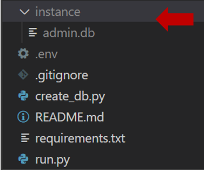

If you modify any of the db modules (which can be found inside the 'modules' folder), or if you make changes to the create_db.py file, you may want to delete the database instance before running the app again.
Note that when you delete the db instance, you will lose all data previously added to it (user accounts, blog posts, etc). The create_db.py file will re-generate all dummy data, but the data you have added yourself will be lost. 
In the case you want to avoid the loss of data, it is recommended you do a database migration instead of deleting the database instance.

Tip for VS Code users: for information on how to use SQLite with an extension check out https://www.youtube.com/watch?v=bKixKfb1J1o&list=LL&index=2&t=47s

[ <a href="#table-of-contents">↑ to top ↑</a> ]

---

## Project limitations and improvement ideas
The project's limitations are also an opportunity for future development. Some ideas of what could be improved are:

1. Removing code redundancies
2. Improving search queries
3. Admin response to contact form from within the app
4. Improved inbox
5. Improve post recommentations and allow sharing
6. Including a content calendar and mailing list
7. Improving password and authentication
8. Improving safety in user-entered data

**1. Removing code redundancies**

There are several route functions that perform similar tasks. These could be improved by separating code redundancies into functions inside the general helper files, and re-using them in several routes. 

**2. Improving search queries**

Database search queries could be optimized, especially regarding the .all() results.

**3. Admin response to contact form from within the app**

It would be of help to admin users to be warned of incomming contact form messages in the dashboard, and allow them to answer without leaving the app.

**4. Improve post recommentations, mailing list, and calendar**

The inbox could be improved to highlight unread replies to user's comments, or also updates on threads where the user had engaged in conversation in general. 

**5. Improve post recommentations and allow sharing**

A functionality that afacilitates the sharing of posts in social media would be of value. Also, post recommendations could be improved with AI: to recommend to users posts that would interest them based on past bookemarked or liked posts. 

**6. Including a content calendar and mailing list**

A content-calendar would enable admins and authors to organize their posting schedules better. Mailing news to subscribed users would then help the blog management remind users to come back to the block and check out the new content.

**7. Improving password and authentication**

It would be a better idea to verify passwords and emails, or verify if the user is indeed human. Including a 'forgot password' functionality and making the user enter a password twice are important updates required. Alternatively, enabling google log-ins or similar would pass on the authentication issues to other companys who are already set up to authenticate users.

**8. Improving safety in user-entered data**

Data validation could be improved in many areas, one of which is the comment/reply section. Stopping users from spamming the comment section by not allowing the posting of links and similar is important.  
Another area would be when adding/editting a blog post. Giving authors the ability to edit the html opens many doors that bad actors could exploit. 

Another area where safety can be improved is the image upload. The app configuration is set not to allow big files to be uploaded, and the filename is being checked for unsafe extensions. This check occurs in the back-end in the case front-end validation fails. There are, however, many other measures that could be implemented. Here is some reading material that explores this topic:

- File Upload Cheat Sheet: https://cheatsheetseries.owasp.org/cheatsheets/File_Upload_Cheat_Sheet.html
- Input Validation Cheat Sheet: https://cheatsheetseries.owasp.org/cheatsheets/Input_Validation_Cheat_Sheet.html
- Cross Site Scripting Prevention Cheat Sheet: https://cheatsheetseries.owasp.org/cheatsheets/Cross_Site_Scripting_Prevention_Cheat_Sheet.html
- Handling File Uploads with Flask: Handling File Uploads With Flask

[ <a href="#table-of-contents">↑ to top ↑</a> ]

## About and license

This blog was created to be submitted as the author's final project for the CS50 course from HarvardX.

This is a personal project completed by the author, which you are welcome to use and modify at your discretion. The author, owners and maintainers of this project are not liable for any damages or losses caused by the use of this project. Use this project at your own risk. The owners and maintainers of this project do not provide any warranties or guarantees regarding the reliability, accuracy, or completeness of this project. By using this project, you agree to hold harmless the owners and maintainers of this project from any liability, damages, or losses that may arise from the use of this project.

[ <a href="#table-of-contents">↑ to top ↑</a> ]

