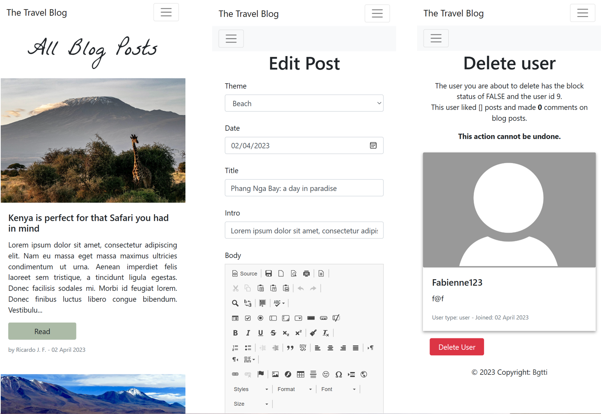
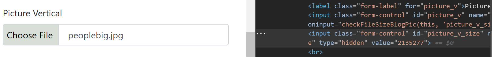

# blog_flask
A responsive travel blog template with admin section created using python flask and bootstrap.
The blog pages 'Home', 'All Posts', 'About', and 'Contact' can be viewed by any person accessing the website, while it also contains a log-in and sign-up section, where users can create an account to like and bookmark posts, as well as use the comment section. An admin and author dashboards is also available, where posts and users can be added, editted, and deleted. 

## About this project
This project is composed of a blog and blog management interface which allow for multiple user classes.
The project was written in python flask (using Blueprints), using SQLite as the database (with the help of SQLalchemy), and uses bootstrap and CSS for styling.
JavaScript was only used when necessary: to determine sizes of images prior to upload, and to allow for comments, bookmarking, and liking posts, as well as alert message display without re-loading the page for a better user experience.

### User classes
There are 5 types of user classes (implicit and explicit):
**Visitors:** webside visitors or logged out users can view the following pages: 'Home', 'All Posts', 'About', and 'Contact'. A visitor can also create an account (which will automatically create a user of type 'user'), and a logged-out user can sign in.
**User:** a logged-in user of type 'user' can bookmark or like posts. The user can also comment and reply to comments in blog posts. The user can edit his/her username, email, picture, and 'about' section.
**Author:** authors can do the same things as users of type 'user', as well as add posts, edit posts, and delete posts.
**Admin:** admins can do the same things as users of type 'user', as well as:
 - block, delete, and edit any users' and authors' accounts,
 - change a user's type to 'author' or 'admin'. Can change a user's type from 'author' to 'user'. Cannot edit, delete, or block other 'admin' type accounts.
 - approve, disapprove, and edit blog posts. Note admins can edit blog posts, but cannot create a blog post from scratch
**Super-Admin:** there is only one super-admin account. Supera-admins can do everything an admin user can do, as well as managing admin-type accounts as well (allowing for editting, blocking, and deletion of these accounts).

### Contact
Messages sent through the blog's 'contact' page are received by a gmail account. 
Messages received through the contact form are also stored in an SQLite database.

### Log in validation
Validation uses WTforms

### How the code is organized
The blog_flask folder contains:
- 'app' folder: where the code is
- '.env' file: with sensitive information such as the email address and password used to receive email from the contact form. Can't be downloaded, so instructions how to create it can be found in the setup section bellow.
- '.gitignore': which is used to inform git about files that shouldn't be uploaded to the git repository, such as the .env file. Can't be downloaded, so instructions how to create it can be found in the setup section bellow.
- 'create_db.py': the file used to use the db models to create the database. It is also used to create the 'Super-Admin' user, which is necessary in order to allow for the creation of 'admin' and 'author' accounts. It also sets up dummy user accounts which can be used for testing, and the blog posts, blog themes and dummy comments, likes and bookmarks.
- 'requirements.txt': stores the required dependencies for this project.
- 'run.py': used to create the app, initiate the database, and populate the database using the 'create_db.py' file.

Once you run 'run.py', the database will be initiated and an 'instance' folder will be created as well.

The routes were separated into four base folders inside the 'app' folder: website, account, dashboard, and error_handlers. The reason for this was to create a better separation of concerns by dividing the routes according to user access through Blueprints, to avoid one huge .py file and make navigating the code an easier task. We shall explore the 'app' folder next in more detail.

In the 'app' folder, you will find the following:
- 'account' folder: contains 'routes.py' which are all the routes that can be accessed by a logged-in user (routes to the log-in, sign-up, and log-out pages, dashboard, account management page, etc), as well as 'helpers.py' containing helpful functions such as hashing a password and checking if an image expension is allowed, and 'forms.py' used for a Flask Form Class.
- 'dashboard' folder: contains 'routes.py' which contains routes that can be accessed by 'admin' and 'author' type users (routes for user account and post management pages), as well as a 'forms.py' used for a Flask Form Class.
- 'dummie_data' folder: contains files with lists of information about authors, comments, posts, and themes which are used by 'create_db.py' to add the information in these files to insert information to the database when the project is first run. The data will be used to create dummie users, comments, posts, and themes that are necessary to first preview the blog. 
- 'error_handlers' folder: contains 'routes.py' which render the 404 and 500 error pages.
- 'models' folder: contains multiple files which are database models necessary to instanciate the database.
- 'static' folder: contains the CSS and JS files, as well as folders containing pictures used in blog posts and user profiles.
- 'templates' folder: contains the html files. 'base.html' is used to extend all other files. Besides 'base.html', '404.html' and '500.html', all other html files are placed into three folders ('account', 'dashboard', and 'website'), according to the Blueprint names (where you will find the routes).
- 'website' folder: contains 'routes.py' which has the routes to website pages which visiting users can access (such as the home page, 'All Posts', 'About', and 'Contact').
- '\__init__.py': used to mark a directory and indicate that is is a package. This file registers the Blueprints, for instance.
- 'config.py': stores key value pairs that can be read or accessed in the code.
- 'extensions.py': used to define and organize extensions. It is used to register the SQLAlchemy, CKEditor, and LoginManager extensions with the Flask app instance app, allowing them to be used throughout the application.

## Installation: how to use this project
Anyone is welcome to use this code (please see the liability clause at the end of this file). 
A couple of steps are needed for you to be able to run it properly:

1. install the required dependencies
2. create an .env file
3. create a .gitignore file
4. open run.py to run the code

### Step 1: installing the dependencies
When you open the folder with your code editor, you will find the requirements.txt file.
Use the pip install -r requirements.txt command to install all the modules.
If you make changes to the project you can update the requirements.txt or create a new requirements.txt file with the command pip freeze > requirements.txt . This will output a list of all installed Python modules with their versions.
Example:
Python 3.x
Flask
Jinja2

### Step 2: create a .env file
Create a .env file inside the blog_flask folder.
You should add the following variables:

EMAIL_ADDRESS = "..." <-- replace "..." with your gmail address
EMAIL_PASSWORD = "..." <-- replace "..." with your gmail app password (two-step verification needed)

The email address and password will be used to receive messages sent through the contact form.
The credentials (email address and password) have been saved to an .env file, and the variables imported into app>website>contact.py, which containes a helper function, which is then used in app>website>routes.py. This information must be replaced for the code to work on local by anyone willing to use the codebase.
Messages sent though the contact form are sent and received by a gmail account. If another provider is used, replace "smtp.gmail.com" with the information from the other provider in app>website>contact.py.
At the time of writing, Gmail allowed users to create an app password to send emails from python. You can google ' Sign in with App Passwords - Gmail Help' to learn how to create one (or follow this link: https://support.google.com/mail/answer/185833?hl=en).

### Step 3: create a .gitignore file
Create a .gitignore file inside the blog_flask folder.
You should add the following to it:

instance/

.env

\__pycache__/

Alternatively, you may also find online a better and more complete template to use.
This step is only important if you are using git, since it's purpose is to avoid uploading sensitive information or unecessary files to your repository.

### Step 4: run the app
You can run the run.py file and open it using local host. 
That's it, you have installed the project and are ready to use the code!

## Making changes to this file
You want to make sure you understand how the code works before modifying it, especially regarding the database.

### Understanding the create_db.py file
This file is responsible for populating the database upon running the application. It, however, does a little more than that.

#### Flask needs to understand the db models exist
Adding a model to the modules file may not necessarily create the database on its own. 
The mention of the database model is in create_db.py, and the functions are contained in run.py so that the models are recognized upon running the application.

#### Default user creation is necessary
create_db.py will not only use the user database model to instantiate the database, but it will also populate it with three important users:
1. The Super Admin user of type super_admin: this is the only user capable of changing the status of all other user types. It is the user who can manage admin types of accounts, as it is the only one who can delete or block this type of accounts. If there are no other accounts of type 'admin', this will be the only user capable of giving admin status to another user.
2. The default author: what happens when an author who has published to the blog deletes their accounts? This app understands that the posts belong to the blog, and as such - the post ownership. An author will be able to edit and delete posts while his/her account is still active and not blocked. However, when an author deletes his/her account, the blog shall retain the post's ownership by transfering it to a default author who has been named "The Travel Blog Team".
3. Default user 'Deleted'. All logged in users are able to comment or reply to posts. Users may delete their comments while they have an unblocked active account. What happens when a user deletes their account after commenting? If the comments are deleted but have many replies to them, the thread will simply stop to make sense or disappear. In order to keep threads intact, when a comment is deleted, it's content is substituted by \[deleted], allowing the content of replies to remain instact (an approach similar to Reddit). When the user deleted their accounts, however, the ownership of any comment is transfered to the default 'deleted user', since each comment needs a user id as per database requirement. The username of this account is therefore \[Deleted]

Note that posts also need authors to exist, and without posts there will be no content in the blog, and cause a number of errors. Shall you decide to delete the 'dummie data', consider substituting it instead. 
Consider the database relationships before changing or deleting the dummie data in the create_db.py file.

#### Default users credentials and dummie data
Note that default user credentials are uploaded to the git repo and open for anyone to see. 
In the create_db.py file you will see the log-in credentials for all users created. Shall you decide to use this app, consider transfering the credentials to a .env file or similar to make sure this information is not public.
Needless to say that these credentials should be changed: both email and passwords specifically.

### Changing the database model or the data that populates it on 'run'
When you run this application for the first time, you will note a database instance is created.

If you modify any of the db modules (which can be found inside the 'modules' folder), or if you make changes to the create_db.py file, you may want to delete the database instance before running the app again.
Note that when you delete the db instance, you will lose all data previously added to it (user accounts, blog posts, etc). The create_db.py file will re-generate all dummy data, but the data you have added yourself will be lost. 
In the case you want to avoid the loss of data, it is recommended you do a database migration instead of deleting the database instance.

Tip for VS Code users: for information on how to use SQLite with an extension check out https://www.youtube.com/watch?v=bKixKfb1J1o&list=LL&index=2&t=47s

## This project's limitations and how it could be improved
This project could be a base to built a more rebust blog and blog management system, and some features could be built or improved upon.
To list a few:

1. Form validation and file upload
2. Enabling authors to respond to comments with ease
3. Track user activity to analyse and improve blog engagement

### 1. Form validation and file upload
WTForms was used to aid validation of forms, and a little bit of JavaScript was used to help out.
The client can't be trusted, so some back-end validation was also carried out, though not to the extent it could have been.
One example of this is when the user uploads pictures to be used in blog posts. Here, we check the extension to make sure the file being uploaded is a .png, .jpg. or .jpeg. However, the desired size limit is only being controlled through the front end:

As one can note from the picture above, the size information is being passed on through a hidden form field, and this information can be easily manipulated when inspecting the code. As a fallback, however, the MAX_CONTENT_LENGTH config key was set to limit upload file size to 16 megabytes to avoid issues that could result from ultra large files being uploaded by the user.

Author's posts could also be better validated. 
CKEditor is being used to allow authors to write their blog posts in a way that enables them to edit HTML elements. The text will be saved to the database with these HTML elements, which will in turn be published to the blog when the post is approved by an admin user.
Authors are being allowed to control HTML content since they are supposed to be trusted users of the blog, and admin users are supposed to check and approve the content that will be posted. 

Better safety measures could be put in place, and here are some reading material about possible threats and measures that could be implemented in this regards:

- File Upload Cheat Sheet: https://cheatsheetseries.owasp.org/cheatsheets/File_Upload_Cheat_Sheet.html
- Input Validation Cheat Sheet: https://cheatsheetseries.owasp.org/cheatsheets/Input_Validation_Cheat_Sheet.html
- Cross Site Scripting Prevention Cheat Sheet: https://cheatsheetseries.owasp.org/cheatsheets/Cross_Site_Scripting_Prevention_Cheat_Sheet.html
- Handling File Uploads with Flask: Handling File Uploads With Flask

### 2. Enabling authors to respond to comments with ease
It would be a great addition to the author's dashboard to see the lattest or unread user comments to their posts, so they could respond to them easily.

### 3. Track user activity to analyse and improve blog engagement
Knowing about the topics that users like mosts could help offering suggestions of other posts the user could be interested in.
Information on user activity could improve blog engagement and the offering of benefits to the most active users.
When suggesting user tracking is important to mention that it is meant in an ethical way, and user data should be treated with repect and anonymously.

## Important information and liability
This is a personal project completed by the author, which you are welcome to use and modify at your discretion.
The author, owners and maintainers of this project are not liable for any damages or losses caused by the use of this project. Use this project at your own risk. The owners and maintainers of this project do not provide any warranties or guarantees regarding the reliability, accuracy, or completeness of this project. By using this project, you agree to hold harmless the owners and maintainers of this project from any liability, damages, or losses that may arise from the use of this project.
